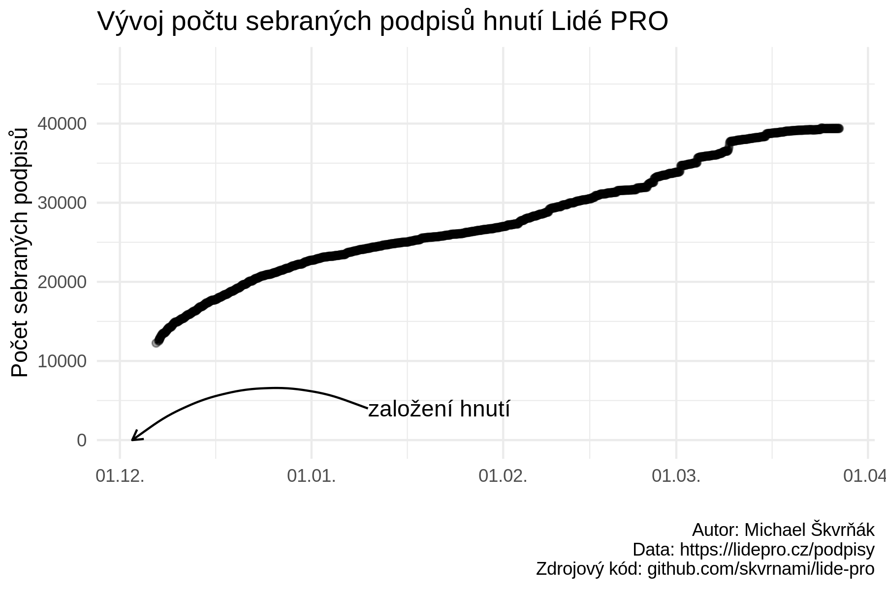

# README

Skript pro scrapování počtu podpisů pro vznik hnutí [Lidé PRO](https://lidepro.cz/) a pohybu na [transparentním účtu hnutí](https://ib.fio.cz/ib/transparent?a=20308993).

## Grafy

### Podpisy

### Transparentní účet

## File manifest

- `src/scrap-signatures-count.R` - skript pro stáhnutí počtu podpisů uvedených na stránce [Lidé PRO](https://lidepro.cz/podpisy)  
- `src/chart-data.R` - skript pro vygenerování grafů o sběru podpisů  
- `src/scrap-transparent-account.R` - skript pro stáhnutí finančních transakcí na transparentním účtu  
- `src/chart-money.R` - skript pro vygenerování grafu o finančních transakcích  
- `src/scrape-signature-champions.js` - skript pro stažení dat o "podpisových šampionech"  
- `output/output.csv` - data s počty podpisů (sloupec time je v časové zóně UTC)  
- `output/money.csv` - data o finančních transakcích na transparentním účtu  
- `output/champions.csv` - data o podpisových šampionech  

